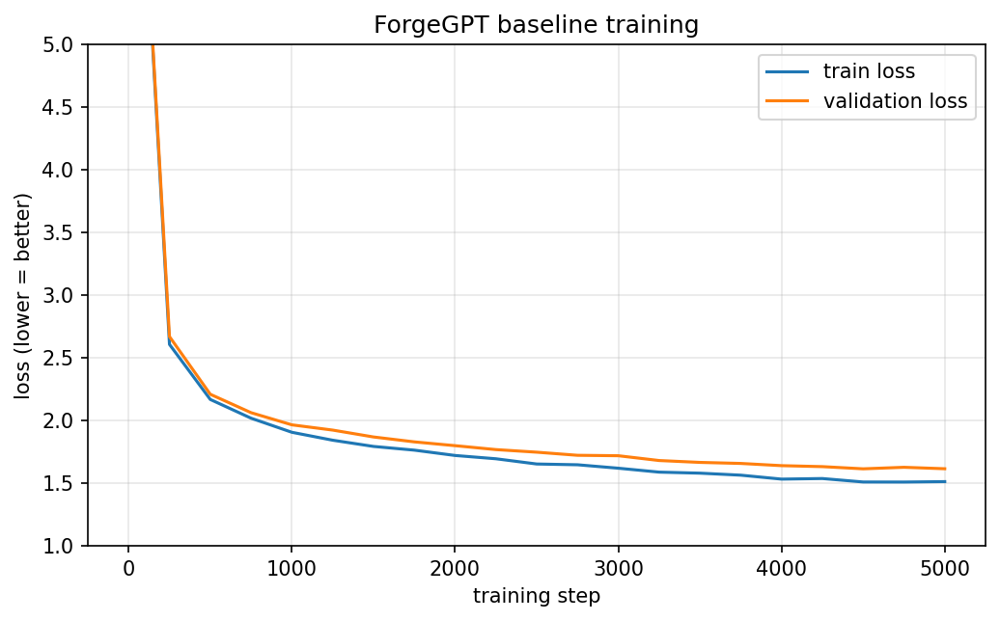
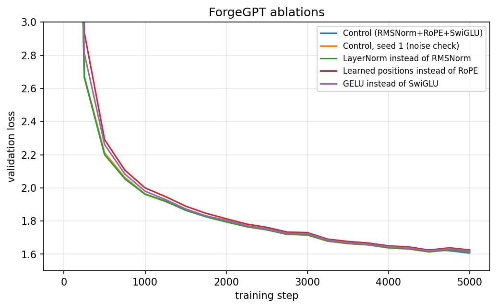

# ForgeGPT

**A GPT-style language model built and trained from scratch in PyTorch, with architecture ablations.**

ForgeGPT implements every component of a modern decoder-only transformer by hand (no pretrained weights, no Hugging Face model classes): a custom BPE tokenizer, RoPE, RMSNorm, SwiGLU, KV-cache generation, and a resumable mixed-precision training loop. It was trained on a free Colab T4 GPU and writes simple children's stories.

---

## Highlights

- 12.2M-parameter model trained from scratch on TinyStories (about 70M tokens)
- Validation loss **1.615**, perplexity **5.03** on held-out stories
- Custom BPE tokenizer (vocabulary of 4,096) trained on the data
- KV-cache generation verified to give **identical output** to uncached generation
- Ablation study of three modern components, with a seed-noise measurement
- Resumable training that survives Colab disconnects

---

## What is implemented

| Component | What it does |
|---|---|
| BPE tokenizer | Splits text into 4,096 subword tokens (trained with the `tokenizers` library) |
| Causal self-attention | Each token attends only to earlier tokens (6 heads) |
| RoPE | Rotary position embeddings: encode word order by rotating query/key vectors |
| RMSNorm | Lightweight normalization that keeps activations at a stable scale |
| SwiGLU | Gated feed-forward layer |
| Residual connections | Each sub-layer adds to its input, keeping earlier information intact |
| Weight tying | Output layer shares weights with the token embedding |
| KV-cache | Reuses past keys/values during generation |
| Sampling | Temperature, top-k and top-p |
| Training engine | AdamW, warmup + cosine learning-rate schedule, gradient accumulation, gradient clipping, fp16 mixed precision, atomic checkpoints with auto-resume |

---

## Model and training setup

| Setting | Value |
|---|---|
| Parameters | 12.2M |
| Layers / heads / embedding size | 6 / 6 / 384 |
| Context length | 256 tokens |
| Vocabulary | 4,096 (own BPE tokenizer) |
| Dataset | TinyStories: first 300,000 stories for training (69.9M tokens), 10,000 stories for validation (2.1M tokens) |
| Steps | 5,000 |
| Effective batch | 128 sequences x 256 tokens = 32,768 tokens/step (about 164M tokens seen) |
| Optimizer | AdamW, peak lr 1e-3 decaying to 1e-4, weight decay 0.1 |
| Hardware | Google Colab T4, about 95,000 tokens/sec, about 30 minutes per run |

---

## Results

### Training curve



Final validation loss **1.615** (perplexity **5.03**). Final training loss was about 1.51, so the train/validation gap is small (about 0.1): the model is learning, not memorizing.

### Sample generations

Prompt: `Once upon a time, there was a little dog named Max.`

**Temperature 0.8** (best balance):

> Once upon a time, there was a little dog named Max. Max liked to play outside and chase his ball. One day, Max saw a big slide and wanted to go down it. But it was too steep for him. So, Max decided to be careful and go down the slide. As Max was running down the slide, he saw a man walking by. The man had a big red hat and a long beard. [...]

**Temperature 1.2** (too random: note the invented word "heets" and the incoherent phrasing):

> [...] When they got to the airport, Max's eyes were full of heets. He saw so many things to watch and see how they felt. [...]

More samples, including temperature 0.3, are in [`results/samples.md`](results/samples.md).

### Ablation study

Each variant changes **one** component of the baseline (RMSNorm + RoPE + SwiGLU). All runs use the same data, data order, hyperparameters and 5,000 steps. "Avg of last 3 evals" smooths evaluation noise.

| Variant | Final val loss | Avg of last 3 evals | Perplexity | vs control |
|---|---|---|---|---|
| Control (RMSNorm + RoPE + SwiGLU) | 1.609 | 1.608 | 4.99 | +0.000 |
| Control, seed 1 (noise check) | 1.613 | 1.617 | 5.04 | +0.009 |
| LayerNorm instead of RMSNorm | 1.615 | 1.619 | 5.05 | +0.011 |
| Learned positions instead of RoPE | 1.626 | 1.629 | 5.10 | +0.021 |
| GELU instead of SwiGLU | 1.620 | 1.624 | 5.07 | +0.016 |



**Interpretation (honest version):**

- All three older designs scored slightly worse than the control, but by very little: at most about 2% in perplexity (4.99 vs 5.10).
- The gap between two control runs with different seeds was 0.009. The LayerNorm difference (+0.011) is therefore indistinguishable from noise, GELU (+0.016) is suggestive, and learned positions (+0.021) is the clearest signal.
- Each variant was run once (the control twice), so none of these differences is statistically significant. The benefits of modern components are generally expected to grow with model size and training length; this experiment does not test that.

<!-- TODO: if you run the extra-seed runs (abl_learned_pos_s1, abl_gelu_s1), add a row for each and compare them with "Control, seed 1" (1.613). -->

### KV-cache speed

Greedy generation (temperature 0), seconds per generation. Cached and uncached outputs were verified identical.

| New tokens | Batch 1: no cache | Batch 1: KV-cache | Speedup | Batch 32: no cache | Batch 32: KV-cache | Speedup |
|---|---|---|---|---|---|---|
| 50 | 0.44 s | 0.28 s | 1.6x | 0.73 s | 0.29 s | 2.5x |
| 100 | 0.56 s | 0.58 s | 1.0x | 1.64 s | 0.58 s | 2.8x |
| 200 | 1.36 s | 1.13 s | 1.2x | 5.82 s | 1.17 s | 5.0x |

At batch size 1 the model is so small that Python and kernel-launch overhead dominates, so the cache helps little and the timings are noisy. With 32 sequences at once there is enough real compute for the cache to matter, and the speedup grows with sequence length.

### Comparison with GPT-2

<!-- TODO: fill in after Chunk 8. Perplexity can't be compared directly because the tokenizers differ (4,096 vs 50,257 tokens), so compare bits per character on the same validation text. -->

*Coming soon.*

---

## Limitations

- The model was trained only on simple children's stories, so it cannot answer questions or write about other topics.
- Story logic is weak: sentences are fluent, but plots sometimes contradict themselves.
- The ablations are small-scale (12M parameters, 5k steps, one run per variant), so conclusions about which components matter at larger scale cannot be drawn from them.
- Context length is limited to 256 tokens.

---

## Repository structure

```
forgegpt/
├── forgegpt/
│   ├── config.py      # model and training settings (with ablation switches)
│   ├── model.py       # RMSNorm, RoPE, attention, SwiGLU, GPT
│   ├── data.py        # memory-mapped batch loader
│   ├── train.py       # training loop, checkpoints, resume
│   └── generate.py    # sampling and KV-cache generation
├── results/           # loss curves, ablation table, samples
└── README.md
```

---

## Reproduce

1. Open a Google Colab notebook with a T4 GPU.
2. Clone this repo and install `tokenizers`.
3. Download TinyStories, train the tokenizer, and tokenize the data into `train.bin` / `val.bin`.
4. Train the baseline:

```python
from forgegpt.config import GPTConfig, TrainConfig
from forgegpt.train import train

train(GPTConfig(), TrainConfig(run_name="base"))
```

5. Run an ablation by changing one switch, for example:

```python
train(GPTConfig(pos_type="learned"), TrainConfig(run_name="abl_learned_pos"))
```

Available switches: `norm_type` (`rmsnorm` / `layernorm`), `pos_type` (`rope` / `learned`), `mlp_type` (`swiglu` / `gelu`).

---

## Model weights

<!-- TODO: add the Hugging Face link after upload. -->

*Coming soon.*

---

## Acknowledgements

- Dataset: [TinyStories](https://huggingface.co/datasets/roneneldan/TinyStories) (Eldan & Li, 2023)
- Architecture choices follow Llama-style models (RoPE, RMSNorm, SwiGLU)
- Inspired by Andrej Karpathy's nanoGPT

## License

MIT
